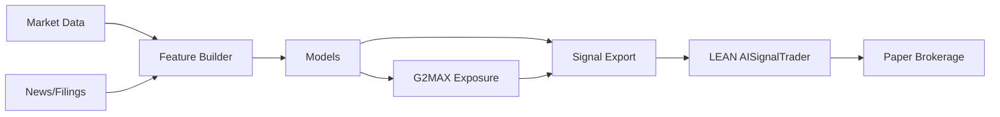

# Whole-Project Uplift — Audit, Synthesize, and Rebuild at Expert Standard

## 1) Executive Summary
1. Research-first trading platform with paper-only defaults and formal gates. [README.md#L1-L193]
2. AI pipeline supports news/market ingestion and optional filings ingestion. [docs/AI_STACK.md#L78-L87][hedge_fund/ai/pipeline.py#L55-L130]
3. G2MAX compounding rule added for exposure sizing with drawdown throttles. [docs/G2MAX_RULE.md#L1-L24][hedge_fund/ai/portfolio/g2max.py#L1-L122]
4. Lean integration consumes exposure signals via AISignalTrader. [lean_projects/AISignalTrader/main.py#L23-L66]
5. Interactive G2MAX visualization available locally. [README.md#L157-L163][tools/g2max_interactive.py#L1-L73]
6. Governance and promotion gates remain explicit. [hedge_fund/utils/contracts.py#L26-L73][gates/README.md#L1-L7]
7. AWS orchestration blueprint and quantum experiments remain optional. [docs/AWS_PIPELINE.md#L1-L101][docs/QUANTUM_FINANCE.md#L1-L48]
8. Legal data sources and compliance constraints documented. [docs/DATA_PIPELINE.md#L1-L15][docs/LEGAL_COMPLIANCE.md#L1-L7]
9. New compounding and edge reading lists curated for research depth. [docs/BOOKS_COMPOUNDING.md#L1-L32][docs/BOOKS_EDGE.md#L1-L30]
10. Conflict-risk research reframed to legal, public event-driven hedging only. [docs/CONFLICT_EVENT_STRATEGY.md#L1-L22]

## 2) Canonical Spec
### Purpose
Build a reproducible research system for signal generation, portfolio sizing, and paper-only execution with auditability. [docs/PRD.md#L1-L57]

### Scope Boundaries
- No live trading by default. [docs/SAFETY_GATES.md#L1-L24]
- Legal/public data only. [docs/DATA_PIPELINE.md#L1-L15]
- No performance guarantees. [docs/ADVANCED_RESEARCH.md#L42-L44]

### Definitions
- **G2MAX**: fractional Kelly + volatility targeting + drawdown throttles. [docs/G2MAX_RULE.md#L1-L24]
- **Signals**: exported to CSV for LEAN ingestion. [hedge_fund/ai/integration/lean_export.py#L73-L147]
- **Promotion Gates**: contracts defining minimum backtest and risk requirements. [hedge_fund/utils/contracts.py#L26-L73]

GAP: Large datasets under `data/` were not fully audited. Assumption: datasets are externally sourced and legally licensed. [docs/DATA_PIPELINE.md#L1-L15]

## 3) System Blueprint
### Architecture (mermaid)


### Data Contracts
- Market data contracts defined in `contracts.py` (schema, timezone, and point-in-time constraints). [hedge_fund/utils/contracts.py#L11-L24]

### Module Interfaces
- Data ingest: `hedge_fund/ai/data/*` with optional filings. [hedge_fund/ai/data/filings.py#L1-L96]
- Pipeline: `hedge_fund/ai/pipeline.py` orchestrates steps and artifacts. [hedge_fund/ai/pipeline.py#L39-L130]
- Signal export: `hedge_fund/ai/integration/lean_export.py`. [hedge_fund/ai/integration/lean_export.py#L73-L147]
- Execution: Lean adapter and IBKR adapters under `hedge_fund/exec`. [hedge_fund/exec/lean.py#L1-L29][hedge_fund/exec/ibkr.py#L1-L42]

## 4) Mathematics & Logic
### G2MAX Exposure Rule
Let \(r_t\) be return, \(\mu_t\) rolling mean, \(\sigma_t^2\) rolling variance.

\[ k_t = \mathrm{clip}(\mu_t/\sigma_t^2, -L, L) \]
\[ s_t = \mathrm{clip}(\sigma^*/\hat{\sigma}_t, 0, L) \]
\[ \text{exposure}_t = \mathrm{clip}(\phi \cdot k_t \cdot s_t \cdot g_t, -L, L) \]

G2MAX uses fractional Kelly sizing with drawdown gates \(g_t\). [docs/G2MAX_RULE.md#L1-L24]

### Sanity Checks
- Exposure bounded by leverage cap. [hedge_fund/ai/portfolio/g2max.py#L58-L118]
- Positive equity constraint. [hedge_fund/ai/portfolio/g2max.py#L108-L122]

## 5) Code Pack
### Minimal runnable examples (Python)
```python
from hedge_fund.ai.portfolio.g2max import G2MaxParams, g2max_exposure
import numpy as np

returns = np.random.normal(0.0002, 0.01, 252)
params = G2MaxParams()
exposure = g2max_exposure(returns, params)
```

### Tests
- `tests/test_g2max_rule.py` validates exposure bounds and equity positivity. [tests/test_g2max_rule.py#L1-L19]
- Existing G2MAX simulation test remains. [tests/test_g2max_x_lab.py#L1-L9]

### Configs & CLI
- AI stack config: `hedge_fund/conf/ai_stack.yaml` (filings + G2MAX export). [hedge_fund/conf/ai_stack.yaml#L1-L89]
- Make targets: `Makefile` (lint/test/optimize). [Makefile#L1-L30]

## 6) Ops & Governance
- Promotion gates in `contracts.py` and `gates/README.md`. [hedge_fund/utils/contracts.py#L26-L73][gates/README.md#L1-L7]
- Paper-only execution and drawdown rules in Lean strategy. [lean_projects/AISignalTrader/main.py#L23-L66]
- Compliance boundaries documented. [docs/LEGAL_COMPLIANCE.md#L1-L7]

## 7) Validation Report
Planned checks:
1. Leakage-safe validation: CPCV + embargo. [docs/AI_STACK.md#L92-L96]
2. Backtest thresholds: drawdown + deflated Sharpe. [hedge_fund/utils/contracts.py#L26-L73]
3. Stress scenarios: regime segmentation and volatility spikes. [docs/RESEARCH_ROADMAP.md#L6-L19]

Known limitations:
- Filings ingestion is a stub and depends on external APIs. [hedge_fund/ai/data/filings.py#L1-L96]
- No live trading controls are implemented by design. [docs/SAFETY_GATES.md#L1-L24]

## 8) Integration Guide
### IBKR
- Use TWS/IB Gateway with paper port 7497. [docs/SETUP.md#L3-L28]
- Smoke test command: `python -m hedge_fund.exec.ibkr_smoke_test`. [README.md#L71-L79]

### Lean
- Export signals via `hedge_fund/ai/integration/lean_export.py`. [README.md#L120-L131]
- AISignalTrader uses `ai_signals.csv` in `data/custom`. [lean_projects/AISignalTrader/README.md#L1-L27]

### AWS (Optional)
- Orchestrate via Step Functions + Batch, with Braket optional. [docs/AWS_PIPELINE.md#L1-L101]

## 9) Style & Editorial
- Maintain concise, technical tone with explicit constraints.
- Use consistent symbol names (see `docs/G2MAX_RULE.md`). [docs/G2MAX_RULE.md#L1-L24]
- Keep legal/compliance boundaries explicit in all docs. [docs/LEGAL_COMPLIANCE.md#L1-L7]

## 10) Change Log
1. Added G2MAX rule implementation and interactive chart. [hedge_fund/ai/portfolio/g2max.py#L1-L122][tools/g2max_interactive.py#L1-L73]
2. Added filings ingestion stub with legal constraints. [hedge_fund/ai/data/filings.py#L1-L96]
3. Integrated G2MAX into signal export and pipeline. [hedge_fund/ai/integration/lean_export.py#L73-L147][hedge_fund/ai/pipeline.py#L107-L130]
4. Updated AISignalTrader to support exposure signals. [lean_projects/AISignalTrader/main.py#L23-L66]
5. Added advanced research and reading lists. [docs/BOOKS_COMPOUNDING.md#L1-L32][docs/BOOKS_EDGE.md#L1-L30]

## 11) Next Actions
1. Enable `signal_export.method=g2max` in `hedge_fund/conf/ai_stack.yaml`. [hedge_fund/conf/ai_stack.yaml#L55-L79]
2. Run `python -m hedge_fund.ai.integration.lean_export`. [README.md#L120-L131]
3. Backtest `lean_projects/AISignalTrader` with `signal_mode=exposure`. [lean_projects/AISignalTrader/README.md#L12-L22]
4. If using filings, set `SEC_USER_AGENT` and configure URLs. [hedge_fund/conf/ai_stack.yaml#L10-L26]

| KPI Summary | target | current | owner | review cadence |
| --- | --- | --- | --- | --- |
| Deflated Sharpe | >= 1.0 | GAP | Research | monthly |
| Max drawdown | <= 0.25 | GAP | Risk | monthly |
| Signal latency (filings) | < 24h | GAP | Data | weekly |
| AI run pass rate | > 90% | GAP | Ops | weekly |

| Roadmap Matrix | deliverable | effort | risk | dependency |
| --- | --- | --- | --- | --- |
| Data ingestion | filings + news normalization | M | Med | API access |
| Modeling | G2MAX + regime filters | M | Med | feature store |
| Backtesting | Lean AISignalTrader with exposure | S | Low | CSV export |
| Ops | CI checks + runbooks | S | Low | Makefile |
