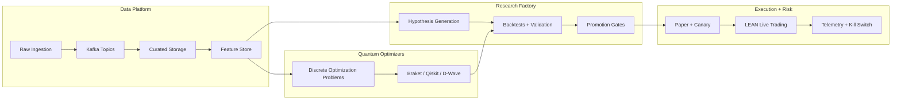

# Architecture Overview

```mermaid
flowchart LR
    subgraph Data[Data Platform]
        Raw[Raw Ingestion] --> Kafka[Kafka Topics]
        Kafka --> Curated[Curated Storage]
        Curated --> Features[Feature Store]
    end

    subgraph Research[Research Factory]
        Features --> Hypotheses[Hypothesis Generation]
        Hypotheses --> Backtests[Backtests + Validation]
        Backtests --> Promotion[Promotion Gates]
    end

    subgraph Execution[Execution + Risk]
        Promotion --> Paper[Paper + Canary]
        Paper --> Live[LEAN Live Trading]
        Live --> Monitoring[Telemetry + Kill Switch]
    end

    subgraph Quantum[Quantum Optimizers]
        Features --> QUBO[Discrete Optimization Problems]
        QUBO --> Braket[Braket / Qiskit / D-Wave]
        Braket --> Backtests
    end
```
